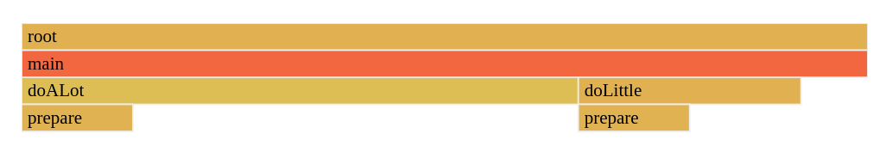

# Demo Pprof

This repository contains a simple pprof demo that should help explaining how different visualization for profiling works.



## Try it yourself:

* On your local machine:

    ```
    $ pprof https://raw.githubusercontent.com/simonswine/demo-pprof/main/cpu.pb.pprof
    ```

* On [pprof.me](https://pprof.me/b9d077f/)
